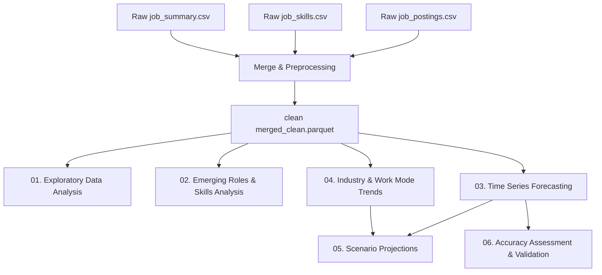

# 🌐 Market Demand Trend Analysis
> **Contextual Market Intelligence & Predictive Analytics Pipeline**

This repository contains an end-to-end data analysis and forecasting pipeline for tracking, modeling, and projecting tech industry job posting volume, skill demand, and outsourcing trends across multiple countries.

---

## 🗺️ Project Pipeline & Architecture

The analytical workflow transitions from raw data ingestion and exploratory analysis to machine learning modeling, time-series forecasting, and economic scenario analysis.



---

## 📂 Notebook Breakdown

The analysis is structured across six sequential Jupyter notebooks:

1. **[01_EDA_and_Data_Preprocessing.ipynb](file:///c:/Users/victus/Desktop/Repository/Market-Demand-Trend-Analysis/notebooks/01_EDA_and_Data_Preprocessing.ipynb)**
   - Merges postings, skills, and summaries on `job_link` to create [merged_clean.parquet](file:///c:/Users/victus/Desktop/Repository/Market-Demand-Trend-Analysis/outputs/reports/merged_clean.parquet).
   - Validates dates, explores distributions (roles, job levels, country, type), and tracks total posting volumes.

2. **[02_Emerging_Roles_and_Skills_Analysis.ipynb](file:///c:/Users/victus/Desktop/Repository/Market-Demand-Trend-Analysis/notebooks/02_Emerging_Roles_and_Skills_Analysis.ipynb)**
   - Explodes and filters skill datasets to identify in-demand technologies.
   - Maps role-skill co-occurrences and clusters job roles using TF-IDF + KMeans clustering.

3. **[03_Time_Series_Forecasting.ipynb](file:///c:/Users/victus/Desktop/Repository/Market-Demand-Trend-Analysis/notebooks/03_Time_Series_Forecasting.ipynb)**
   - Decomposes the posting volume using STL (Seasonal and Trend decomposition using Loess).
   - Implements classical ARIMA/SARIMA, ETS (Exponential Smoothing), and Prophet forecasting models.

4. **[04_External_Factors_and_Industry_Trends.ipynb](file:///c:/Users/victus/Desktop/Repository/Market-Demand-Trend-Analysis/notebooks/04_External_Factors_and_Industry_Trends.ipynb)**
   - Classifies jobs into industries (AI, Data, Cloud, Cybersecurity, Finance, Healthcare, Consulting).
   - Analyzes work-mode trends (Remote/Hybrid/Onsite) and extracts industry keywords via TF-IDF.

5. **[05_Scenario_Analysis.ipynb](file:///c:/Users/victus/Desktop/Repository/Market-Demand-Trend-Analysis/notebooks/05_Scenario_Analysis.ipynb)**
   - Projects future role demand under three economic scenarios (Best Case, Most Likely, Worst Case) with custom Prophet simulations.

6. **[06_Model_Validation.ipynb](file:///c:/Users/victus/Desktop/Repository/Market-Demand-Trend-Analysis/notebooks/06_Model_Validation.ipynb)**
   - Evaluates forecasts on a 25% hold-out test set.
   - Computes MAE, RMSE, and MAPE metrics to select the best forecasting model.

---

## 📈 Model Performance & Validation

Model accuracy was evaluated on a 25% chronological hold-out test set. The validation metrics are:

| Model | MAE | RMSE | MAPE % | Status |
| :--- | :---: | :---: | :---: | :---: |
| **SARIMA** | **469.00** | **486.42** | **123.56%** | **🏆 Best Performer** |
| **ETS** | 649.72 | 697.52 | 181.82% | Moderate Fit |
| **Prophet** | 742.00 | 877.80 | 100.00% | High Seasonality Noise |

SARIMA provides the most accurate and stable forecasts for the overall posting volumes, while Prophet is utilized for scenario simulation.

---

## 🔮 Economic Scenario Summary

To guide strategic decision-making, future demand (30-day forecast horizon) was simulated across three economic climates:

| Scenario | Multiplier | Mean Daily Demand | Peak Daily Demand | Total Projected (30d) | Description |
| :--- | :---: | :---: | :---: | :---: | :--- |
| **Best Case** | 1.30 | 6,278.5 | 12,389.4 | 188,355 | Accelerated AI adoption; data/ML demand surges by 30% |
| **Most Likely** | 1.00 | 4,829.6 | 9,530.3 | 144,889 | Stable current trend continuation; moderate growth |
| **Worst Case** | 0.75 | 3,622.2 | 7,147.7 | 108,666 | Tech hiring freeze & slowdown; 25% demand drop |

---

## 📁 Repository Structure

```
├── Dataset/                   # Raw CSV datasets (postings, skills, summaries)
├── notebooks/                 # Sequential analytical Jupyter notebooks (01-06)
├── outputs/
│   ├── figures/               # Matplotlib PNGs and interactive Plotly HTMLs
│   └── reports/               # Parquet files, CSV metrics, and summaries
├── src/
│   └── utils.py               # Shared utility functions, loaders, and styling
├── requirements.txt           # Project dependencies list
└── README.md                  # Project overview and guide
```

---

## ⚙️ Installation & Setup

1. **Clone the repository** and navigate to the root directory:
   ```bash
   cd Market-Demand-Trend-Analysis
   ```

2. **Create and activate a virtual environment**:
   ```bash
   # On Windows
   python -m venv venv
   .\venv\Scripts\activate
   ```

3. **Install the required dependencies**:
   ```bash
   pip install -r requirements.txt
   ```

4. **Launch the Jupyter interface** to run the notebooks:
   ```bash
   jupyter notebook
   ```